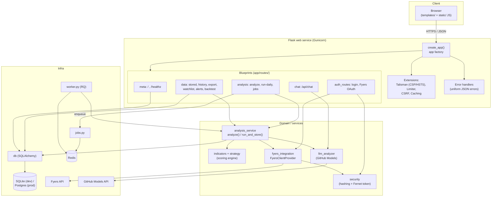

# Architecture

This document describes how the NSE Indicator-Based Trading Dashboard is structured and how
a request or analysis run flows through the system. For setup and usage, see the
[README](../README.md).

## High-level overview



## Components

### App factory (`app/__init__.py`)
`create_app()` builds the Flask app, configures session cookies and CSRF, initializes
extensions (rate limiter, CSRF, cache, Talisman security headers/CSP), registers all
blueprints and centralized error handlers, and ensures the DB schema exists. `wsgi.py`
exposes `app = create_app()` for Gunicorn and `python wsgi.py`.

### Blueprints (`app/routes/`)
Routes are grouped by domain so each module stays small and testable:

- **`meta`** — landing page (`/`) and the public `/healthz` probe (reports DB and Fyers
  token status, job backend, and time).
- **`auth_routes`** — server-side dashboard login/logout (signed session cookie) and the
  Fyers OAuth flow (`/auth/login`, `/auth/callback`, `/auth/connect`).
- **`analysis`** — `/api/analyze` (synchronous live analysis for small universes) and
  `/api/run-daily` (enqueues a full analyze + AI + store job, returns a `job_id`), plus
  `/api/jobs/<id>` for progress polling.
- **`data`** — stored runs, `/api/history/<symbol>` for charts, CSV/XLSX export, watchlist,
  alert rules, and backtest endpoints.
- **`chat`** — the LLM-backed assistant endpoint.

All `/api/*` routes require an authenticated session (`@login_required`); `/healthz` is
public. Abuse-prone endpoints are rate-limited.

### Service layer (`analysis_service.py`)
The single orchestration point shared by the web routes, the background worker, and the CLI
daily runner — avoiding duplicated logic:

- `analyze(...)` — resolves the symbol universe, fetches OHLCV via the Fyers client, runs
  the indicator/scoring engine per symbol, and returns a ranked payload (qualified /
  unqualified / skipped).
- `run_and_store(...)` — runs `analyze`, optionally calls the LLM, persists the run, stock
  rows, and AI recommendations, updates run status, and evaluates alert rules.

### Scoring engine (`indicators.py` + `strategy.py`)
`indicators.py` computes ~25 indicators (Wilder-smoothed RSI/ATR/ADX, MACD, Bollinger
Bands, Stochastic, OBV, MFI, VWAP, SMAs/EMAs, 52-week proximity, crosses) and derives a
`bull_score`, `bear_score`, and a `BUY/NEUTRAL/SELL` signal. Periods and weights live in
`strategy.py` so the strategy is tunable without editing formulas.

### LLM (`llm_analyzer.py`)
Given scored stocks, calls GitHub Models to produce `BUY/HOLD/AVOID` recommendations with
reasoning, targets, and stop-losses. Entirely optional — gated on `GITHUB_TOKEN`.

### Broker integration (`fyers_integration.py`)
A `FyersClientProvider` builds clients on demand (no global mutable state), loads/saves the
access token via `security.py` (encrypted at rest), fetches history in parallel within
Fyers rate limits, and caches the NSE symbol master to disk for 24h. The SDK is imported
lazily so stored mode and tests work without it installed.

### Persistence (`db.py`)
SQLAlchemy 2 models for daily runs, per-stock analysis, AI recommendations, watchlist, and
alert rules. Driven by `DATABASE_URL` (SQLite in dev, Postgres in prod) with connection
pooling and batched writes.

### Background jobs (`jobs.py`, `worker.py`)
`/api/run-daily` enqueues work onto an RQ queue backed by Redis; `worker.py` consumes it and
calls `run_and_store`. If `REDIS_URL` is unset, `jobs.py` falls back to an in-process thread
so the feature works in development.

### Configuration & logging (`config.py`)
A single typed `Settings` (pydantic-settings) is the only place env vars are read. In
production it validates that required secrets are present (fail-fast). Logging is configured
once from `LOG_LEVEL`.

## Request flows

### Login + live analysis
1. Browser POSTs credentials to `/auth/dashboard-login`; on success a signed session cookie
   is set.
2. User connects Fyers via OAuth; the token is encrypted and saved.
3. Browser POSTs to `/api/analyze`; the route loads a Fyers client, calls
   `analysis_service.analyze`, and returns ranked results as JSON.

### Full daily run (background)
1. Browser POSTs to `/api/run-daily`; the route enqueues a job and returns a `job_id`.
2. The RQ worker (or in-process thread) runs `run_and_store`, updating progress.
3. Browser polls `/api/jobs/<job_id>` until completion, then reads the stored run.

### Stored mode (no Fyers)
1. Browser requests `/api/stored-dates`, then POSTs `/api/stored-data` for a chosen date.
2. The `data` blueprint reads directly from the database — no broker connection needed.

## Deployment topology

In production (see `render.yaml`) the system runs as a **web** service (Gunicorn) and a
separate **worker** service, backed by managed **Postgres** and **Redis**. The web service's
health check targets `/healthz`. The same image can run anywhere via the `Dockerfile`.
```
